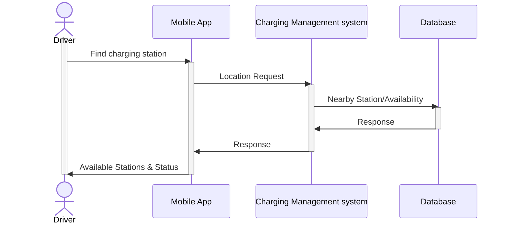
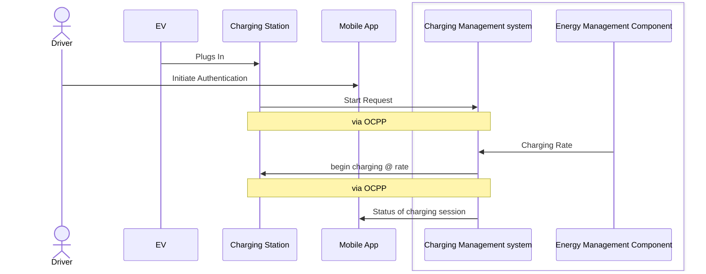

# MoroTechAssignment
## PART-1
This assigment is to document user journey into sequence diagram to represent the interaction and integration among the systems and their component for System integration testing.

### User Journey 1 - Station location
This sequence diagram  shows the process of a mobile app requesting and receiving nearby charging station locations and their realtime availability from a Charging Management System (CMS).  
Assumptions:
    The CMS has access to a database containing station information.
    Diagram does not show the interactions are synchronus or asynchronus.
    The communication between the mobile app and the CMS may be asynchronous.
    The database query may be synchronous.

### User Journey 2 - charging initiation
This sequence diagram  shows the steps involved in initiating a charging session for an electric vehicle.
Assumptions:
    The driver interacts with both the charging station (physically) and the mobile app.
    The communication between the charging station and the CMS is assumed to be synchronous, using the Open Charge Point Protocol (OCPP).
    Diagram does not show the interactions are synchronus or asynchronus.


## PART-2

This assignment is to create API tests for Open Charge Map API; covering two primary endpoints: Get POIs and Get Reference Data. The test's covering response time, status code, response schema and specific business logics.
### Requirements

* postman (for importing and viewing the collection)
* Newman (for running the collection from the command line)
### API Endpoints Tested

1. **Get POIs**
   * Endpoint: '/poi/'     Parameters: 'latitude=51.5074&longitude=0.1278&distance=10&maxresults=5&key=YOUR_API_KEY'
2.  **Get Reference Data:**
* Endpoint: `/referencedata/    Parameters: 'key=YOUR_API_KEY`
3. **Base URL**
  * base URL: 'https://api.openchargemap.io/v3/'
** Note:** Replace `YOUR_API_KEY` with your actual Open Charge Map API key.
### Test Cases

### 1. Get POIs Endpoint

* **Response Time and Status Code:**
    * Verifies that the response time is under 1000ms.
    * Confirms that the status code is 200.
* **Schema Validation:**
    * Validates that the response contains an array of POI objects.
    * Each POI object should have the following required fields:
        * ID
        * AddressInfo (containing Latitude and Longitude)
        * NumberOfPoints
* **Business Logic:**
    * Tests that when requesting POIs with `latitude=51.5074&longitude=0.1278&distance=10&maxresults=5`, exactly 5 results are returned.
    * Verifies that all returned POIs are within 10km of the specified coordinates.

### 2. Get Reference Data Endpoint

* **Response Time and Status Code:**
    * Verifies that the response time is under 1000ms.
    * Confirms that the status code is 200.
* **Schema Validation:**
    * Validates that the response contains arrays for different reference data types (e.g., ChargerTypes, StatusTypes).
    * Each item in these arrays should have an ID and Title.
* **Business Logic:**
    * Verifies that the ChargerTypes array contains entries for both "Fast" and "Slow" chargers (based on `IsFastChargeCapable`).
    * Checks that all StatusTypes have a unique ID.
### Import and Run

 #### Importing into Postman:

1.  Download the collection file - `OpenChargeMapAPI.postman_collection.json` ( inside collection folder).
2.  Download the environmrnt file -  (`MoroTech.postman_environment.json`)
3.  Open Postman.
4.  Click the "Import" button.
5.  Select "File" and choose the downloaded JSON file.
6.  Import the environment file as well.
7.  Ensure that API key is added to the environment variables.
8.  Run the collection within Postman.
   
#### Running with Newman (Command Line)

1.  **Install Newman:**
    ```bash
    npm install -g newman
    ```
2.  **Install node.js:**
    ```bash
    npm install -g npm
    ```
3.  **Export the Postman collection and environment:**
    * In Postman, export the collection and environment as JSON files. Save them to a directory on your computer.
4.  **Run the collection using Newman:**
    ```bash
    newman run OpenChargeMapAPI.postman_collection.json -e MoroTech.postman_environment.json
    ```
    * Replace `OpenChargeMapAPI.postman_collection.json` and `MoroTech.postman_environment.json` with the actual file names and paths.
      
## Analysis of Test Results and Observations

#### Get POIs 
* Verified that Status code is 200 consistantly, **Response time is not always under the limit 1000ms.**
* Schema validation: Ensured fields('ID','AddressInfo','NumberOfPoints') are present in response payload.
* Verified that when specifying 'maxresult' as 5, it returns 5 POIs details.
* Verified that all POIs returned are within 10km from specified coordinates.
#### Get referrence Data
* Verified that Status code is 200 consistantly and response time consistantly comes under 1000ms.
* Schema validation: Ensured the response payload contains arrays of referrence data types like ChargerTypes, StatusTypes, Connectiontypes, Operators, UserTypes etc.
* Verified that ChargerTypes array contains entries for both 'fast' and 'slow' chargers.
* Veriifed thay all the statusType have unique ID.
#### Assumptions and Limitations
* API response time slightly grater than acceptable threshold time to time, it can be due to performance bottleneck.
* API functionalities mostly works: return currect status code, response data inthe expected format, including expected arrays and fields in the response.
* **Assumption**: Assumed that 'AddressInfo.distance' provide the distance from the reference point. Used this value to verify the POIs are within the 10km limit.
 
### Deliverables (Folder Structure) 

* Collection : Contains the API tests.
* Environment : Contains the environment variables, including the API key.
* Report : Contains JUnit- XML reports.
* Data.csv file contains test data.
* README.md (This file)
